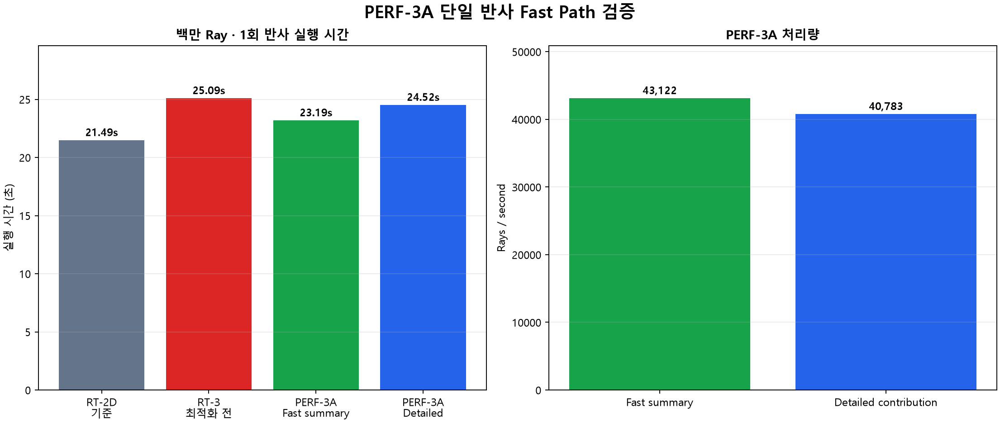

# PERF-3A 단일 반사 성능 최적화 보고서

## 목적
- RT-3 다회 반사 구조 도입 후 발생한 1회 반사 성능 저하를 줄인다.
- 일반적인 직접광·1회 반사 검토는 빠르게 수행하고, 원인 분석이 필요할 때만 상세 기여도를 계산한다.
- Fast mode와 Detailed mode의 광학 결과가 동일한지 검증한다.

## 적용 내용

### 단일 반사 Fast Path
- `max_depth=0~1`은 `single_bounce_fast` 실행 경로를 사용한다.
- `max_depth>=2`는 기존 `multi_bounce` loop를 사용한다.
- 1회 반사에서는 반복 bounce 상태 관리와 불필요한 분기 비용을 줄인다.

### 기여도 집계 모드
- `Fast summary`: Receiver 결과, 직접광·반사광, 반사 모델 및 기본 depth 집계만 유지한다.
- `Detailed contribution`: Component, face, material별 전체 기여도를 추가 집계한다.
- 두 모드는 ray 생성, CAD 교차, 반사 방향, 감쇄, Receiver 누적 계산이 동일하다.

## 백만 Ray 측정 결과

| 조건 | 실행 시간 | 처리량 | RT-2D 기준 차이 |
| --- | ---: | ---: | ---: |
| RT-2D 기준 | 21.49초 | 약 46,533 rays/s | 기준 |
| RT-3 초기 구현 | 28.82초 | 약 34,696 rays/s | 약 34% 저하 |
| RT-3 depth 집계 최적화 | 25.09초 | 약 39,850 rays/s | 약 17% 저하 |
| PERF-3A Fast summary | 23.19초 | 약 43,122 rays/s | 약 7.9% 저하 |
| PERF-3A Detailed contribution | 24.52초 | 약 40,783 rays/s | 약 14.1% 저하 |

## 정확도 검증
- Fast summary Receiver hit: `1,000,000`
- Detailed contribution Receiver hit: `1,000,000`
- Fast summary Receiver flux: `0.4783742890 lumen`
- Detailed contribution Receiver flux: `0.4783742890 lumen`
- 두 모드의 Receiver flux 차이: `0.0 lumen`
- 저장 ray path와 reflection summary 동등성 테스트를 통과했다.

## 회귀 테스트
- 기존 RT-1~RT-3 테스트와 PERF-3A 테스트를 포함해 총 `46개` 테스트가 통과했다.
- `max_depth=1`에서 `single_bounce_fast`, `max_depth=2`에서 `multi_bounce`가 선택되는지 검증했다.
- Fast summary가 Component/face/material 상세 집계만 생략하는지 검증했다.

## 권장 사용 방식
- 빠른 구조 검토와 반복 설계 비교: `Fast summary`
- 특정 부품·면·소재의 빛샘 원인 분석: `Detailed contribution`
- Fast summary는 광학 계산을 단순화하지 않으므로 Receiver 밝기와 hit 결과는 Detailed mode와 동일하다.

## 결론
- 최초 약 34%였던 1회 반사 성능 저하를 약 7.9%까지 줄였다.
- 목표 범위였던 백만 Ray `22~23초대`에 진입했다.
- 남은 차이는 RT-3 공통 depth·termination 관리 비용이며, 추가 batch/vectorization은 PERF-3B에서 검토한다.

## 생성 파일
- 그래프: `docs/reports/perf3a/perf3a_single_bounce.png`
- 원시 결과: `docs/reports/perf3a/summary.json`
- 재생성: `python scripts/benchmark_perf3a.py`
