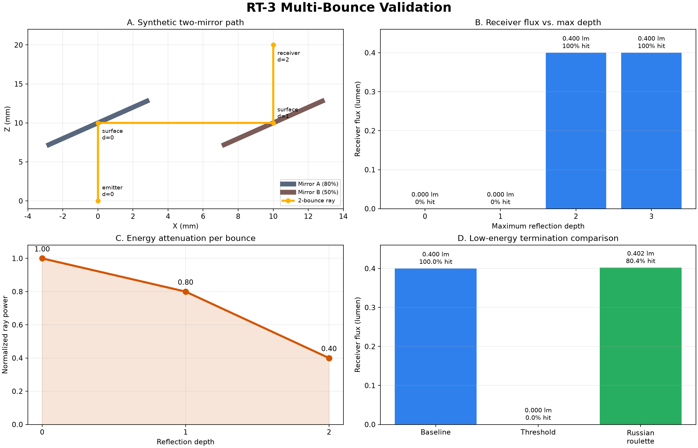

# RT-3 다회 반사 검증 보고서

## 검증 목적
- `max_depth` 설정에 따라 실제 반사 횟수가 제한되는지 확인한다.
- 반사할 때마다 소재 반사율만큼 ray power가 감쇄되는지 확인한다.
- deterministic energy threshold와 Russian roulette 종료 방식이 의도대로 동작하는지 확인한다.
- ray path와 기여도 결과에 bounce depth가 기록되는지 확인한다.

## 합성 모델
- Emitter power: `1.0 lumen`
- Mirror A reflectance: `0.8`
- Mirror B reflectance: `0.5`
- Receiver 도달에 필요한 반사 횟수: `2회`
- 검증 ray 수: `5,000`
- 예상 Receiver flux: `1.0 × 0.8 × 0.5 = 0.4 lumen`

## 주요 결과

| 조건 | Receiver hit | Receiver flux | 판정 |
| --- | ---: | ---: | --- |
| `max_depth=0` | 0% | 0.000 lm | 직접광만으로 도달 불가 |
| `max_depth=1` | 0% | 0.000 lm | 두 번째 mirror에서 종료 |
| `max_depth=2` | 100% | 0.400 lm | 예상값과 일치 |
| `max_depth=3` | 100% | 0.400 lm | 불필요한 추가 반사 없음 |
| energy threshold | 0% | 0.000 lm | 두 번째 반사 power가 threshold 미만이라 종료 |
| Russian roulette | 80.4% | 0.402 lm | ray 수는 감소하고 기대 광속은 0.4 lm 근처로 유지 |

## 검증 결론
- 다회 반사 loop와 `max_depth=1~3` 제한이 정상적으로 동작한다.
- 반사별 광량은 `1.0 → 0.8 → 0.4`로 계산되어 에너지 감쇄식과 일치한다.
- threshold 방식은 빠르고 보수적으로 저에너지 ray를 제거한다.
- Russian roulette는 일부 ray를 제거하면서 생존 ray의 weight를 보정해 평균 광량을 유지한다.
- 저장 경로는 `Emitter(depth 0) → Surface(depth 0) → Surface(depth 1) → Receiver(depth 2)` 순서로 기록된다.

## 생성 파일
- HTML: `docs/reports/rt3_multibounce/rt3_multibounce_report.html`
- PNG: `docs/reports/rt3_multibounce/rt3_multibounce_validation.png`
- JSON: `docs/reports/rt3_multibounce/summary.json`
- 재생성 명령: `python scripts/generate_rt3_multibounce_report.py --output docs/reports/rt3_multibounce`
